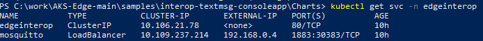

# Interop Windows Console App with AKS Edge Linux container

## Progress
- [x] [Step 1 - Setup Azure Kubernetes Service Edge Essentials (AKS edge)](/docs/AKS-Lite-Deployment-Guidance.md)
- [x] [Step 2 - Develop and publish the Linux container](./Documentation/Develop%20and%20publish%20the%20Linux%20container.MD)
- [ ] **Step 3 - Deploy the containers onto the AKS edge Edge Device**
- [ ] [Step 4 - Build and run the Companion Application](./Run%20the%20Console%20Application.MD)
---

# Step 3: Deploy the containers onto the AKS edge Edge Device

## Deploy Mosquitto MQTT Broker
1. First create a namespace for your demo artifacts:
    ```powershell
    kubectl create namespace edgeinterop
    ```
2. In your PowerShell, navigate to *Charts* folders inside the sample directory and run:
    ```powershell
    kubectl apply -f mosquitto -n edgeinterop
    ```
    This will deploy your Mosquitto MQTT broker to your `edgeinterop` namespace.

3. Now you'll need the internal IP of the service. Run:
    ```powershell
    kubectl get svc -n edgeinterop 
    ```
    And retrieve the Cluster-IP and port of the Mosquitto service.

    

## Deploy the Edge Interop Module 

1. Before deploying the *edgeinterop* module, you need to make sure you can access the container registry from the AKS Edge device. When using *Azure Container Registry*, there are two options:
    - [Enabling anonymous pulling](https://learn.microsoft.com/azure/container-registry/anonymous-pull-access)
    - [Pull images from an Azure container registry to a Kubernetes cluster using a pull secret](https://learn.microsoft.com/azure/container-registry/container-registry-auth-kubernetes)

1. From inside the *Charts\edgeInterop* folder, create a copy of `edgeinterop.yaml` file into `deployment.yaml` file
    ```powershell
    cp .\edgeinterop.yaml .\deployment.yaml
    ```
1. Once your modules are created, open the `deployment.yaml` file.

2. In line 38, edit the `image` with the tag name you used in Step 2 of this demo.

3. In line 41, replace the following values:
    - `BOOTSTRAP_SERVERS`: Internal IP of the Mosquitto service you retrieved earlier
    - `BOOTSTRAP_PORT`: MQTT Server port of the Mosquitto service
    - `CLIENT_ID`: MQTT Client Id
    - `SUBSCRIBE_TOPIC`: MQTT Subscribe topic
    - `PUBLISH_TOPIC` :  MQTT Publishing topic

    For example, using the following values:

    ```bash
    env:
    - name: BOOTSTRAP_SERVERS
        value: "192.168.0.4"
    - name: BOOTSTRAP_PORT
        value: "1883"
    - name: CLIENT_ID
        value: "aks-edge-edgeinterop"
    - name: SUBSCRIBE_TOPIC
        value: "sub"
    - name: PUBLISH_TOPIC
        value: "pub"
    imagePullSecrets:
    - name: secret-acr
    ```

4. Save and close the file.

5. In your PowerShell, run:
    ```powershell
    kubectl apply -f deployment.yaml
    ```

6. Make sure your pods are running:
    ```powershell
    kubectl get pods -n edgeinterop
    ```

8. Check that the connection was successful by running the command below, replacing the pod name with your own:
    ```powershell
    kubectl logs <edgeinterop-pod-name> -n edgeinterop
    ```

    It should state that the MQTT broker connected.

Go to [Next Step](./Run%20the%20Console%20Application.MD)  