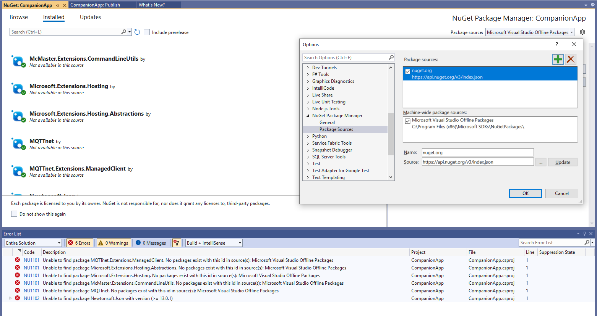
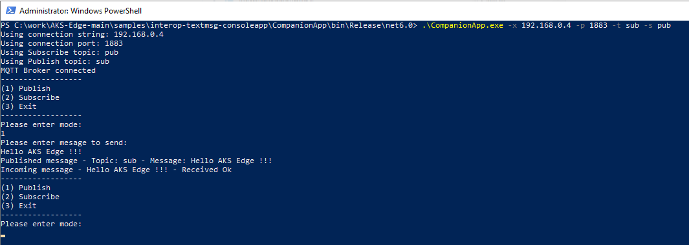

# Interop Windows Console App with AKS Edge Linux container

## Progress
- [x] [Step 1 - Setup Azure Kubernetes Service Edge Essentials (AKS edge)](/docs/AKS-Lite-Deployment-Guidance.md)
- [x] [Step 2 - Develop and publish the Linux container](./Develop%20and%20publish%20the%20Linux%20module.MD)
- [x] [Step 3 - Deploy the containers onto the AKS edge Edge Device](./DeployContainersOnAKSLiteEdgedevice.md)
- [ ] **Step 4 - Build and run the Companion Application**
---

# Step 4: Build and run the Companion Application

The final steps are to build and run the companion app, and start sending messages back and forth with the Linux container. 

1. Open Visual Studio and select the **Companionapp.sln** solution.

1. If you're seeing issues with the NuGet package restore, add NuGet package source *nuget.org* with URL *https://api.nuget.org/v3/index.json*

    

1. Right-click **Companionapp** project, and select _Publish_.

1. Select _Folder_ as the publishing _Target_. Then specify the folder location.

1. Ensure all _Settings_ are correctly configured and then select _Publish_. If everything was correct, you should see an executable file was created under your target folder. 

1. Open an elevated PowerShell session.

1. Move to the target output folder

1. Get all the executable parameters
    ```powershell
    CompanionApp.exe --help
    ```

    The available parameters for configuration are the following:

    | Parameter | Option | Description |
    | --------- | ------ | ----------- |
    | Help | -? -h --help | Show help information.
    | Mosquitto Broker address | -x --connectionServer | Connection server to MQTT broker. By default will try localhost. | 
    | Mosquitto Broker port | -p --connectionPort | Connection server to MQTT broker port. B default uses port 1883 | 
    | MQTT Publish topic | -t --pubTopic | Topic used for publishing messages. _Note: The publish topic should match the subscribe topic of the Linux container| 
    | MQTT Subscribe topic | -s --subTopic | Topic used for subscribe to messages. _Note: The subscribe topic should match the publish topic of the Linux container. |

1. Run the companion app with the appropriate parameters
    ```powershell
    CompanionApp.exe -x <brokerAddress> -p <brokerPort> -t <pubTopic> -s <subTopic>
    ```

1. Once the application is running, select option _(1) Produce_ to send a message to the Linux container. If everything is correctly configured, you should receive a response from the Linux container with the original message modified. 

    

## Feedback
If you have problems with this sample, please post an issue in this repository.