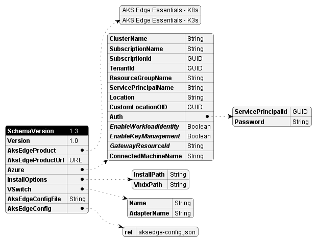

# AksEdgeDeploy (aide)

AksEdgeDeploy module enables you to automate the AKS edge installation, deployment and provisioning easily with a simple json specification.

The `Start-AideWorkflow` function in the modole does the following:

- Installs the required version of the AKS edge
- Validate the json parameters
- Creates the required network switch
- Deploys the AKS edge virtual machine with the json parameters
- Verifies the AKS edge virtual machine is up and running

## Usage

1. Populate the *aide-userconfig.json* with the desired parameters and values. Below is the minimal configuration example for a single machine deployment with 4GB memory.

    ```json
    {
        "SchemaVersion": "1.0",
        "Version": "1.0",
        "AksEdgeProduct" : "AKS Edge Essentials - K8s (Public Preview)",
        "AksEdgeConfig": {
            "DeployOptions": {
                "SingleMachineCluster": true
            },
            "EndUser": {
                "AcceptEula": true,
                "AcceptOptionalTelemetry" : true
            },
            "LinuxVm": {
                "CpuCount": 4,
                "MemoryInMB": 4096,
                "DataSizeinGB": 20
            }
        },
        "Azure": {
            "SubscriptionName":"Visual Studio Enterprise",
            "SubscriptionId": "",
            "TenantId":"",
            "ResourceGroupName": "aksedgepreview-rg",
            "ServicePrincipalName" : "aksedge-sp",
            "Location" : "EastUS"
        }
    }
    ```

2. Call `Start-AideWorkflow` with the json file as input. This will perform the deployment.

```powershell
Start-AideWorkflow -jsonFile 'C:\MyConfigs\aide-userconfig.json'
```

## JSON schema

The below table provides the details of the supported parameters in the json file.
| Parameter | Required | Type / Values | Comments |
| --------- | -------- |---------------- | -------- |
| SchemaVersion | Mandatory | 1.1 | Fixed value, schema version. Reserved|
| Version | Mandatory | 1.0 | Fixed value, json instance version. Reserved |
| AksEdgeProduct | Mandatory | AKS Edge Essentials - Kxs (Public Preview) | Desired product K8s or K3s |
| AksEdgeProductUrl | Optional | URL | URL to download the MSI |
| Azure.ClusterName | Optional | String | Name of the cluster for Arc connection. Default is hostname-distribution (abc-k8s or def-k3s)|
| Azure.SubscriptionName | Mandatory | GUID | SubscriptionName  |
| Azure.SubscriptionId | Optional | GUID | SubscriptionId  |
| Azure.TenantId | Optional | GUID | TenantId  |
| Azure.ResourceGroupName | Mandatory | String | ResourceGroupName  |
| Azure.ServicePrincipalName | Mandatory | String | ServicePrincipalName  |
| Azure.Location | Mandatory | String | Location  |
| Azure.Auth.ServicePrincipalId |Optional | String | Specify service principal appID to use|
| Azure.Auth.Password |Optional| String | Specify the password (clear) |


The below table provides the schema for the AksEdge Deployment Configuration json.

| Parameter | Required | Type / Values | Comments |
| --------- | -------- |---------------- | -------- |
| DeployOptions.SingleMachineCluster | Mandatory | Boolean | SingleMachine with internal switch  created when true |
| DeployOptions.NodeType | Optional | <ul><li>Linux</li><li>Windows</li><li>LinuxAndWindows</li></ul> | Windows only is supported in Full Kubernetes deployment |
| DeployOptions.NetworkPlugin | Optional | <ul><li>calico</li><li>flannel</li></ul> | flannel is default |
| DeployOptions.Headless | Optional | Boolean | Headless mode |
| DeployOptions.TimeoutSeconds|Optional|Int| This specifies the maximum wait for a kubernetes node to reach a specified state (eg. Ready) |
| DeployOptions.JoinCluster|Optional| Boolean | the new deployment will join an existing remote cluster. SingleMachineCluster should be false when this is set to true |
| DeployOptions.ControlPlane|Optional|Boolean| This parameter indicates that the Linux node of this deployment will join an existing cluster as a node that runs the control plane |
| DeployOptions.ClusterJoinToken|Optional|String| The cluster join token used for joining an existing cluster |
| DeployOptions.DiscoveryTokenHash|Optional|String| The discovery token hash used for joining an existing cluster |
| EndUser.AcceptEula | Mandatory | Yes |  Accept Eula |
| EndUser.AcceptOptionalTelemetry | Optional | Yes |  Accept optional telemetry to be sent |
| LinuxVm.CpuCount | Optional |2 | CpuCount|
| LinuxVm.MemoryInMB | Optional |2| MemoryInMB|
| LinuxVm.DataSizeInGB | Optional | 2-2000| Size in GB|
| LinuxVm.Ip4Address | Optional | IPv4 address |  Static IP Address for the Linux Node VM |
| WindowsVm.CpuCount | Optional |2 | CpuCount|
| WindowsVm.MemoryInMB | Optional |2| MemoryInMB|
| WindowsVm.Ip4Address | Optional | IPv4 address |  Static IP Address for the Windows Node VM |
| Network.VSwitch.Type | Optional | External |Only **External** switch supported currently. SingleMachine cluster uses Internal switch always and does not required to be specified.|
| Network.VSwitch.Name | Optional | String | Switch name to use |
| Network.VSwitch.AdapterName | Mandatory | String | NetAdapterName for VSwitch, mandatory for Full kubernetes deployment |
| Network.ControlPlaneEndpointIp | Optional | IPv4 address |  This parameter allows defining a specific IP address to be used as the control plane endpoint IP for the deployment. If not specified, the endpoint will equal the local Linux node's IP address when creating a new cluster |
| Network.ServiceIPRangeSize | Optional | IPv4 address |  Required for SingleMachine deployment |
| Network.ServiceIPRangeStart | Optional | IPv4 address |  Required for Scalable deployment |
| Network.ServiceIPRangeEnd | Optional | IPv4 address |  Required for Scalable deployment |
| Network.Ip4GatewayAddress | Optional | IPv4 address | Static Gateway IP Address |
| Network.Ip4PrefixLength | Optional | [1..32] | IP PrefixLength |
| Network.Proxy.Http | Optional | String | HttpProxy link |
| Network.Proxy.Https | Optional | String | HttpsProxy link |
| Network.DnsServers | Optional | [IPv4 address] | Array of valid dns servers for VM |

## JSON schema visualization

### AksEdgeDeploy User Config



### AksEdge Deployment Config


## Supported Functions

| Functions |   Description |
|:------------ |:-----------|
|`Start-AideWorkflow -jsonFile (or) -jsonString`| Main funtion that validates the user config, installs AksEdge, creates switch, deploys and provisions VM |
| **Config Functions** |  |
|`Get-AideUserConfig`| Returns the json object that is cached |
|`Set-AideUserConfig -jsonFile (or) -jsonString`| Sets the user config and reads the config into the cache |
|`Read-AideUserConfig`| Reads the json file into the cache |
|`Test-AideUserConfig`| Tests the User Config json for parameter correctness |
|**VM Switch Functions** ||
|`New-AideVmSwitch`| Creates an new VM switch based on user config. If Internal switch is specified, it also assigns a static ip address (no DHCP used) |
|`Test-AideVmSwitch -Create`| Tests if the VM switch is present, `Create` flag invokes New-AideVmSwitch if switch is not present |
|`Remove-AideVmSwitch`| Removes the VM switch if present. Also removes the Nat if created (for internal switch) |
|**Deployment functions**||
|`Invoke-AideDeployment`| Validates the deployment parameters in user json and deploys AKS edge VM|
|`Test-AideDeployment`| Tests if the AKS edge VM is deployed (present) |
|`Remove-AideDeployment`| Removes the existing deployment |
|`Test-AideLinuxVmRun`| Tests if the AKS edge VM is running in the machine |
|**MSI Install functions**||
|`Get-AideMsiVersion`| Returns the installed product name and version (PSCustom object with Name,Version) or Null if none found|
|`Install-AideMsi`| Installs the requested product from the aksedgeProductUrl if specified, otherwise it installs the latest (default)|
|`Test-AideMsiInstall -Install`| Tests if AKS edge is installed and `Install` switch is specified, it installs when not found|
|`Remove-AideMsi`| Removes the installed AKS edge product|
|**Helper functions**||
|`Get-AideHostPcInfo`| Gets the PC information such as OS version etc|
